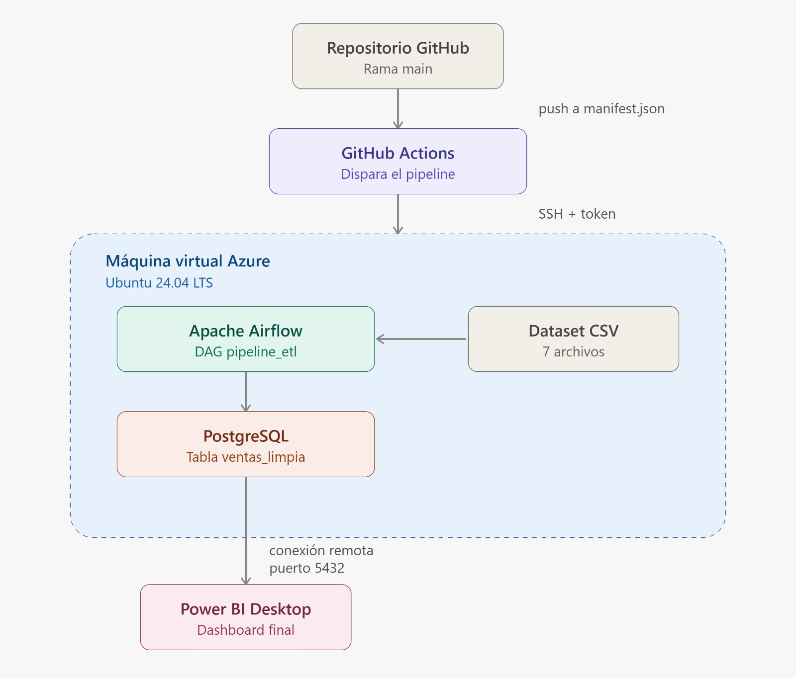
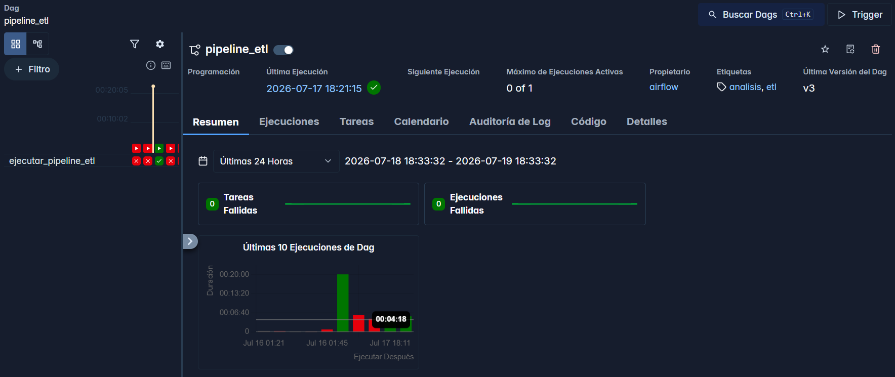
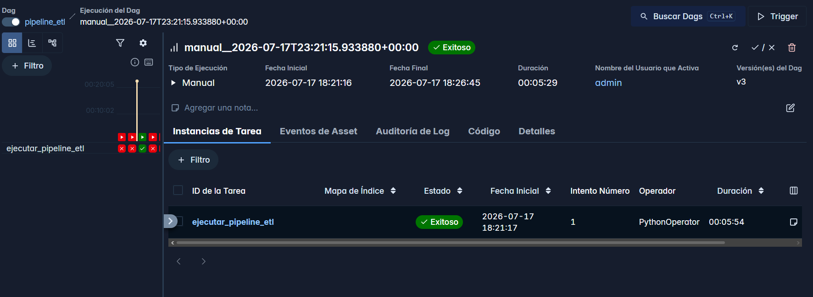
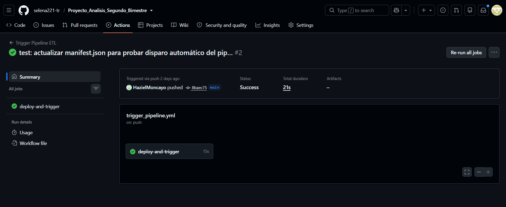
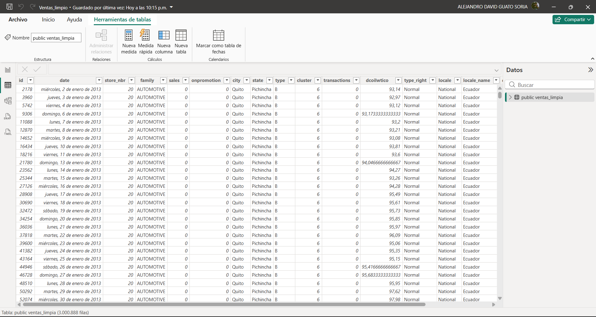

# Proyecto de Análisis - Segundo Bimestre

Pipeline de datos ETL orquestado con Apache Airflow, desplegado en una máquina virtual de Azure, con integración continua mediante GitHub Actions y visualización final en Power BI.

Repositorio: [selena221-tr/Proyecto_Analisis_Segundo_Bimestre](https://github.com/selena221-tr/Proyecto_Analisis_Segundo_Bimestre.git)

---

## 1. Descripción del proyecto

Se desarrolló un pipeline de datos completo para el procesamiento del dataset de ventas de "Corporación Favorita" (cadena de tiendas de Ecuador), abarcando desde la ingesta de los archivos originales hasta la disposición final de los datos limpios en una base de datos relacional, lista para su consumo desde Power BI.

Se optó por una arquitectura reproducible y automatizada, en la que:

- Se utilizó **Polars** como motor de procesamiento de datos por su eficiencia frente a datasets de gran volumen (más de 3 millones de registros).
- Se utilizó **Apache Airflow** como orquestador del pipeline, encargado de ejecutar las etapas de carga, limpieza, transformación, validación y exportación como un DAG único.
- Se desplegó toda la infraestructura sobre una **máquina virtual Ubuntu 24.04 LTS en Microsoft Azure**, dentro del plan de suscripción "Azure for Students".
- Se configuró **GitHub Actions** para disparar automáticamente la ejecución del pipeline cada vez que se actualiza el archivo `manifest.json` en la rama principal del repositorio, cumpliendo con el requisito de automatización de la entrega.
- Se conectó **Power BI Desktop** directamente a la base de datos PostgreSQL alojada en la VM, para la construcción del dashboard final

El resultado es un flujo de trabajo en el que el equipo puede actualizar el código o señalar una nueva ejecución mediante un simple `git push`, sin necesidad de intervención manual sobre el servidor.

---

## 2. Descripción de los archivos del dataset y su rol en el pipeline

Los archivos de datos corresponden al dataset público **"Store Sales - Time Series Forecasting"** (Corporación Favorita) y se ubican en la carpeta `data/` de la máquina virtual (no se versionan en GitHub por su tamaño).

| Archivo | Descripción | Rol en el pipeline |
|---|---|---|
| `train.csv` | Histórico de ventas diarias por tienda y familia de producto (2013-2017). ~3.000.888 registros. | Dataset principal (`ventas_principal`); base sobre la que se construye el dataset unificado final. |
| `stores.csv` | Catálogo de las 54 tiendas: ciudad, estado, tipo y clúster. | Se une (`join`) al dataset principal para enriquecer cada venta con la ubicación y tipo de tienda (`ventas_54`). |
| `holidays_events.csv` | Feriados y eventos especiales en Ecuador, con alcance local, regional o nacional. | Se une para identificar qué días fueron feriados y su posible efecto en las ventas (`ventas_feriado`). |
| `oil.csv` | Precio diario del petróleo (variable macroeconómica relevante para la economía ecuatoriana). | Se une como variable exógena (`precio_petroleo`), útil para el análisis de tendencia. |
| `transactions.csv` | Número de transacciones por tienda y día. | Se une para aportar una medida de afluencia de clientes independiente de las ventas en dólares (`transacciones`). |
| `test.csv` | Conjunto de datos sin la variable objetivo, reservado para escenarios de predicción. | No se usa en el pipeline de limpieza actual; queda disponible para una futura etapa de modelado. |
| `sample_submission.csv` | Plantilla de ejemplo para el formato de envío de predicciones (uso propio de la competencia original de Kaggle). | No se usa en el pipeline; se conserva como referencia. |

### Etapas de transformación sobre estos archivos

1. Se cargaron los 5 datasets relevantes (`ventas_principal`, `ventas_54`, `ventas_feriado`, `precio_petroleo`, `transacciones`) con Polars.
2. Se estandarizaron los formatos de fecha en todos los datasets.
3. Se eliminaron registros duplicados.
4. Se imputaron valores nulos (por ejemplo, en `precio_petroleo` se detectaron y completaron 43 valores nulos).
5. Se corrigieron los tipos de datos de cada columna según su esquema definitivo.
6. Se unificaron los 5 datasets en una única tabla (`ventas_limpia`) mediante uniones (`join`) por fecha y número de tienda.
7. Se validó la ausencia de duplicados y nulos en el dataset final.
8. Se generó un reporte de calidad de datos en formato JSON (`reportes/reporte_datasets.json`).
9. Se exportó la tabla final `ventas_limpia` a PostgreSQL.

---

## 3. Diagrama de arquitectura de la solución




### Componentes de infraestructura

| Componente | Detalle |
|---|---|
| Proveedor cloud | Microsoft Azure (suscripción Azure for Students) |
| Máquina virtual | `proyectoAnalisis` – Ubuntu Server 24.04 LTS, tamaño Standard_D2s_v3 (2 vCPU, 8 GiB RAM) |
| Región | Chile Central |
| Orquestador | Apache Airflow 3.x (modo `standalone`, ejecutado como servicio `systemd`) |
| Procesamiento | Polars |
| Base de datos | PostgreSQL 16 |
| CI/CD | GitHub Actions (`appleboy/ssh-action`) |
| Visualización | Power BI Desktop (conexión directa por PostgreSQL, puerto 5432) |
| Memoria adicional | Swap de 4 GiB configurado para prevenir errores de memoria (OOM) durante la exportación |

---

## 4. Descripción del DAG: tareas, dependencias y configuración

El DAG se define en `dags/pipeline_etl.py`.

| Propiedad | Valor |
|---|---|
| `dag_id` | `pipeline_etl` |
| Descripción | Ejecuta el pipeline ETL para cargar, limpiar y preparar los datos |
| `start_date` | 2024-01-01 |
| `schedule` | `None` (ejecución únicamente manual o disparada por API/GitHub Actions) |
| `catchup` | `False` |
| `tags` | `etl`, `analisis` |

### Tareas

El DAG está compuesto por una única tarea de tipo `PythonOperator`:

| Tarea (`task_id`) | Tipo | Función invocada | Descripción |
|---|---|---|---|
| `ejecutar_pipeline_etl` | `PythonOperator` | `dag_pipeline_etl()` → `ejecutar_pipeline()` (`src/etl.py`) | Ejecuta de forma secuencial: carga de datasets, limpieza, transformación, validación, generación de reporte y exportación a PostgreSQL. |

No existen dependencias entre tareas dentro del DAG, ya que todo el flujo del pipeline se encapsuló en una sola función de Python (`ejecutar_pipeline`), que internamente llama a los módulos de `src/` (`carga.py`, `limpieza.py`, `transformacion.py`, `validacion.py`, `evaluacion_inicial.py`, `exportacion.py`) en el orden correspondiente.

### Configuración relevante aplicada sobre la tarea

-Se configuró el parámetro do_xcom_push=False con el fin de evitar que Airflow intentara enviar a XCom los DataFrames completos retornados por la función. Esta medida previene errores de validación, debido a que estos objetos no son serializables al formato JSON requerido por XCom.

### Configuración del entorno de Airflow

Para evitar problemas de disponibilidad y consumo excesivo de recursos, se ajustaron las siguientes variables de entorno en el servicio:

| Variable | Valor | Motivo |
|---|---|---|
| `AIRFLOW_HOME` | `/home/azureuser/pipeline/airflow` | Ubicación de configuración y metadatos de Airflow. |
| `PYTHONPATH` | `/home/azureuser/pipeline/proyecto` | Permite que el DAG importe correctamente los módulos del paquete `src`. |
| `AIRFLOW__CORE__PARALLELISM` | `4` | Limita el número de tareas ejecutándose en paralelo en toda la instancia. |
| `AIRFLOW__CORE__MAX_ACTIVE_TASKS_PER_DAG` | `2` | Limita el número de tareas activas simultáneas por DAG. |
| `AIRFLOW__CORE__MAX_ACTIVE_RUNS_PER_DAG` | `1` | Limita a una única ejecución activa del DAG a la vez. |

Estos ajustes se aplicaron después de detectar que, sin restricción, Airflow llegaba a lanzar más de 60 procesos `worker` en simultáneo, lo que consumía memoria innecesariamente y provocaba fallos por falta de recursos (`OOM Killer`).

---

## 5. Proceso del pipeline: descripción de cada etapa

### Etapa 1 — Carga de datos (`src/carga.py`)

Se cargaron los 5 datasets desde la carpeta `data/` utilizando Polars, registrando en el log el rango de fechas disponible en cada uno.

### Etapa 2 — Limpieza (`src/limpieza.py`)

Se aplicaron, en orden, las siguientes funciones sobre cada dataset:
- `estandarizacion_fechas`: normalización del formato de fecha.
- `eliminar_duplicados`: remoción de registros duplicados (se confirmó 0 duplicados en los 5 datasets).
- `imputacion_nulos`: completado de valores faltantes (43 nulos detectados y corregidos en `precio_petroleo`).
- `correccion_tipo_datos`: ajuste de tipos (enteros, categóricos, fechas, booleanos) según el esquema definitivo de cada tabla.

### Etapa 3 — Transformación (`src/transformacion.py`)

Se unificaron los 5 datasets en una sola tabla (`ventas_limpia`) mediante `unificar_datasets`, uniendo por clave de fecha y número de tienda.

### Etapa 4 — Validación (`src/validacion.py`)

Se validó el dataset unificado (`validar_dataset`) confirmando la ausencia de duplicados, y se aplicó una limpieza final (`limpieza_final`) sobre el resultado unido.

### Etapa 5 — Generación de reporte (`src/evaluacion_inicial.py`)

Se generó un reporte JSON (`generar_reporte`) con estadísticas de cada dataset: número de filas, columnas, tipos de datos, nulos y porcentaje de duplicados.

### Etapa 6 — Exportación a PostgreSQL (`src/exportacion.py`)

Se exportó la tabla `ventas_limpia` a la base de datos `proyectoAnalisis` mediante el método nativo `write_database` de Polars (a través del driver `adbc-driver-postgresql`), reemplazando la tabla completa en cada ejecución (`if_table_exists="replace"`).

> Se descartó el uso de `to_pandas().to_sql()` (SQLAlchemy) como método de exportación, ya que la conversión completa del DataFrame a Pandas antes de la escritura por bloques (`chunksize`) provocaba el agotamiento de la memoria disponible en la VM (error `OOM Killer`) para un dataset de más de 3 millones de filas. El método nativo de Polars resolvió este problema.

### Capturas del proceso en Airflow

**Resumen general del DAG en la interfaz de Airflow**, mostrando 0 tareas y ejecuciones fallidas tras la resolución de errores:



**Ejecución exitosa del DAG `pipeline_etl`** disparada desde la interfaz de Airflow:



---

## 6. Métricas del pipeline

### Tiempos de ejecución registrados

| Ejecución | Duración total | Resultado | Observación |
|---|---|---|---|
| Primera ejecución exitosa (sin exportación a Postgres) | 7 s | Éxito | `exportar_a_postgres=False` |
| Ejecución con exportación (método Pandas + chunksize) | ~6 min (falló) | Fallido | Error `SIGKILL` / OOM por conversión completa a Pandas |
| Ejecución con exportación (método `write_database` de Polars, sin ajuste de recursos) | ~4.5 min (falló) | Fallido | OOM Killer por exceso de procesos worker paralelos |
| Ejecución final exitosa (con swap + límites de paralelismo) | **336 s (~5.6 min)** | **Éxito** | Exportación completa de 3.000.888 registros a PostgreSQL |

### Registros procesados por etapa

| Dataset | Filas antes | Filas después de limpieza | Columnas |
|---|---|---|---|
| `ventas_principal` (train.csv) | 3.000.888 | 3.000.888 | 6 |
| `ventas_54` (stores.csv) | 54 | 54 | 5 |
| `ventas_feriado` (holidays_events.csv) | 350 | 350 | 6 |
| `precio_petroleo` (oil.csv) | 1.218 | 1.704 | 2 |
| `transacciones` (transactions.csv) | 83.488 | 83.488 | 3 |
| **Dataset unificado (`ventas_limpia`)** | — | **3.000.888** | **17** |

> El aumento de filas en `precio_petroleo` (de 1.218 a 1.704) corresponde al proceso de imputación de fechas faltantes en el calendario, no a duplicación de registros.

### Registros eliminados en limpieza

| Dataset | Duplicados eliminados | Nulos imputados |
|---|---|---|
| `ventas_principal` | 0 | 0 |
| `ventas_54` | 0 | 0 |
| `ventas_feriado` | 0 | 0 |
| `precio_petroleo` | 0 | 43 |
| `transacciones` | 0 | 0 |
| **Dataset unificado (`ventas_limpia`)** | 0 (0,00 %) | 0 tras limpieza final |

### Tamaño final en base de datos

- Tabla `ventas_limpia`: **3.000.888 filas**, **502 MB** en PostgreSQL.

---

## 7. Integración continua con GitHub Actions

Se configuró el workflow `.github/workflows/trigger_pipeline.yml`, el cual se activa automáticamente ante cualquier cambio en el archivo `manifest.json` dentro de la rama `main`. El workflow:

1. Se conecta por SSH a la máquina virtual de Azure utilizando credenciales almacenadas como *secrets* del repositorio (`VM_HOST`, `VM_USER`, `VM_SSH_KEY`).
2. Ejecuta `git pull origin main` para actualizar el código del proyecto en la VM.
3. Solicita un token de autenticación a la API de Airflow (`/auth/token`), requerido por el "Simple Auth Manager" de Airflow 3.x.
4. Dispara una nueva ejecución del DAG `pipeline_etl` mediante la API REST de Airflow (`/api/v2/dags/pipeline_etl/dagRuns`).

**Ejecución exitosa del workflow en GitHub Actions:**



Se verificó el correcto funcionamiento de extremo a extremo confirmando, tras cada ejecución disparada desde GitHub, la actualización del archivo físico de la tabla `ventas_limpia` en PostgreSQL mediante la consulta `pg_stat_file`, así como el estado `success` de la ejecución correspondiente vía la API de Airflow.

---

## 8. Capturas del dashboard de Power BI

Se estableció la conexión entre Power BI Desktop y la base de datos PostgreSQL alojada en la VM de Azure, mediante el conector nativo "PostgreSQL database", utilizando la dirección IP pública de la VM y el puerto 5432 (habilitado explícitamente en el grupo de seguridad de red de Azure).

**Conexión exitosa y detección de la tabla `ventas_limpia`:**



> Nota de seguridad: se dejó constancia de la advertencia emitida por Azure respecto a la exposición del puerto 5432 a internet. Para un entorno de producción real se recomienda restringir el origen permitido a IPs específicas y reforzar la contraseña de la base de datos; para efectos de este proyecto académico se mantuvo abierto para facilitar el acceso del equipo de trabajo.

*(Los visuales específicos del dashboard —gráficos de ventas por tienda, por familia de producto, evolución temporal, etc.— se agregan como capturas adicionales en esta sección conforme se construyen en Power BI.)*

---

## 9. Despliegue: instrucciones para reproducir el ambiente

### 9.1 Creación de la máquina virtual (Azure)

1. Se creó una máquina virtual en Azure con las siguientes características:
   - Imagen: Ubuntu Server 24.04 LTS (x64, gen. 2)
   - Tamaño: Standard_D2s_v3 (o equivalente con al menos 4 GiB de RAM)
   - Región: una de las habilitadas para la suscripción utilizada (verificar en Azure Policy → "Allowed resource deployment regions")
   - Autenticación: clave pública SSH
2. Se habilitaron los siguientes puertos de entrada en el grupo de seguridad de red (NSG):

   | Puerto | Protocolo | Uso |
   |---|---|---|
   | 22 | TCP | Conexión SSH |
   | 8080 | TCP | Interfaz web de Airflow |
   | 5432 | TCP | Conexión remota a PostgreSQL (Power BI) |

### 9.2 Instalación de dependencias en la VM

```bash
sudo apt update && sudo apt upgrade -y
sudo apt install postgresql postgresql-contrib python3 python3-pip python3-venv git -y
sudo systemctl enable --now postgresql

mkdir -p ~/pipeline
cd ~/pipeline
python3 -m venv venv
source venv/bin/activate
pip install --upgrade pip
pip install polars apache-airflow psycopg2-binary sqlalchemy pandas pyarrow adbc-driver-postgresql
```

### 9.3 Configuración de PostgreSQL para acceso remoto

```bash
sudo -u postgres psql -c "ALTER USER postgres PASSWORD '1234';"
sudo sh -c "echo \"listen_addresses = '*'\" >> /etc/postgresql/16/main/postgresql.conf"
sudo sh -c "echo \"host all all 0.0.0.0/0 md5\" >> /etc/postgresql/16/main/pg_hba.conf"
sudo systemctl restart postgresql
sudo -u postgres psql -c "CREATE DATABASE \"proyectoAnalisis\";"
```

### 9.4 Clonado del repositorio en la VM

```bash
cd ~/pipeline
git clone https://github.com/selena221-tr/Proyecto_Analisis_Segundo_Bimestre.git proyecto
pip install -r ~/pipeline/proyecto/requirements.txt
```

> Los archivos del dataset (`data/`) no se versionan en el repositorio; deben transferirse manualmente a `~/pipeline/proyecto/data/` mediante `scp`.

### 9.5 Configuración de Airflow como servicio permanente

Se creó el archivo `/etc/systemd/system/airflow-standalone.service`:

```ini
[Unit]
Description=Airflow Standalone
After=network.target postgresql.service

[Service]
Type=simple
User=azureuser
Environment="AIRFLOW_HOME=/home/azureuser/pipeline/airflow"
Environment="PYTHONPATH=/home/azureuser/pipeline/proyecto"
Environment="PATH=/home/azureuser/pipeline/venv/bin:/usr/local/sbin:/usr/local/bin:/usr/sbin:/usr/bin:/sbin:/bin"
Environment="AIRFLOW__CORE__PARALLELISM=4"
Environment="AIRFLOW__CORE__MAX_ACTIVE_TASKS_PER_DAG=2"
Environment="AIRFLOW__CORE__MAX_ACTIVE_RUNS_PER_DAG=1"
ExecStart=/home/azureuser/pipeline/venv/bin/airflow standalone
Restart=always
RestartSec=5

[Install]
WantedBy=multi-user.target
```

Activación del servicio:

```bash
sudo systemctl daemon-reload
sudo systemctl enable airflow-standalone
sudo systemctl start airflow-standalone
```

### 9.6 Memoria swap (recomendado)

Para prevenir fallos por falta de memoria durante la exportación de datasets grandes:

```bash
sudo fallocate -l 4G /swapfile
sudo chmod 600 /swapfile
sudo mkswap /swapfile
sudo swapon /swapfile
echo '/swapfile none swap sw 0 0' | sudo tee -a /etc/fstab
```

### 9.7 Configuración de GitHub Actions

1. Se generó un par de claves SSH exclusivo para GitHub Actions en la VM:
   ```bash
   ssh-keygen -t ed25519 -f ~/.ssh/github_actions_key -N ""
   cat ~/.ssh/github_actions_key.pub >> ~/.ssh/authorized_keys
   ```
2. Se registraron los siguientes *secrets* en el repositorio (Settings → Secrets and variables → Actions):

   | Secret | Valor |
   |---|---|
   | `VM_HOST` | IP pública de la VM |
   | `VM_USER` | `azureuser` |
   | `VM_SSH_KEY` | Clave privada generada (`github_actions_key`) |

3. Se agregó el archivo `.github/workflows/trigger_pipeline.yml` con la lógica de conexión, actualización de código y disparo del DAG vía API de Airflow con autenticación por token.

### 9.8 Conexión desde Power BI Desktop

1. Obtener datos → PostgreSQL database.
2. Servidor: `<IP_PUBLICA_VM>:5432` — Base de datos: `proyectoAnalisis`.
3. Autenticación: usuario `postgres`, contraseña configurada en el paso 9.3.
4. Seleccionar la tabla `ventas_limpia` y cargar los datos.

> Si Power BI reporta un error de certificado SSL al conectar, debe deshabilitarse el cifrado de la conexión desde Archivo → Opciones y configuración → Configuración de origen de datos → Editar permisos → desmarcar "Cifrar conexiones".

### 9.9 Consideraciones al reiniciar la VM

Dado que Azure puede asignar una nueva IP pública cada vez que la VM se detiene y se vuelve a iniciar (no se configuró IP estática), al reiniciar el entorno se recomienda:

1. Verificar la IP pública vigente desde el portal de Azure.
2. Confirmar que los servicios `postgresql` y `airflow-standalone` se reanudaron automáticamente (`sudo systemctl status <servicio>`).
3. Actualizar el secret `VM_HOST` en GitHub si la IP cambió.
4. Actualizar la cadena de conexión en Power BI si la IP cambió.

---

## 10. Conclusiones y recomendaciones

### Conclusiones

- Se logró implementar un pipeline de datos de extremo a extremo, completamente reproducible y desplegado en la nube, que procesa más de 3 millones de registros en un tiempo de ejecución cercano a los 5,6 minutos.
- Se comprobó que Apache Airflow 3.x introduce cambios significativos respecto a versiones anteriores (sintaxis del DAG, autenticación de la API, ausencia de comandos como `db init` o `users create`), lo cual debió resolverse de forma iterativa durante el desarrollo.
- Se identificó que la conversión de DataFrames de gran tamaño a Pandas antes de su exportación constituye un cuello de botella crítico de memoria; el uso de métodos nativos de Polars (`write_database`) resultó ser la alternativa más eficiente.
- Se logró automatizar completamente el disparo del pipeline mediante GitHub Actions, cumpliendo el requisito de integración continua, condicionado a que la máquina virtual permanezca encendida.
- Se verificó la correcta integración con Power BI mediante conexión directa a PostgreSQL, habilitando el acceso remoto a la base de datos de forma controlada mediante el grupo de seguridad de red de Azure.

### Recomendaciones

- **Recursos de la VM**: se recomienda considerar un tamaño de máquina virtual con mayor memoria RAM si el volumen de datos del proyecto continúa creciendo, dado que incluso con las optimizaciones aplicadas, el procesamiento se acerca al límite de los recursos disponibles.
- **Seguridad de la base de datos**: se recomienda, para un entorno más allá del académico, restringir el acceso al puerto 5432 únicamente a las IPs del equipo de trabajo y reemplazar la contraseña actual por una de mayor robustez.
- **IP pública estática**: se recomienda configurar una IP pública estática en Azure para evitar tener que actualizar manualmente los secrets de GitHub y la cadena de conexión de Power BI cada vez que se reinicia la VM.
- **Disponibilidad continua**: dado que la automatización depende de que Airflow esté activo, se recomienda mantener la VM encendida durante los periodos de trabajo colaborativo del equipo, o evaluar una alternativa de cómputo bajo demanda si se busca optimizar costos.
- **Manifest.json**: se recomienda evolucionar el archivo `manifest.json` para que, además de actuar como disparador, incluya metadatos funcionales (por ejemplo, qué datasets fueron actualizados), permitiendo que el DAG ejecute lógica condicional en el futuro.
